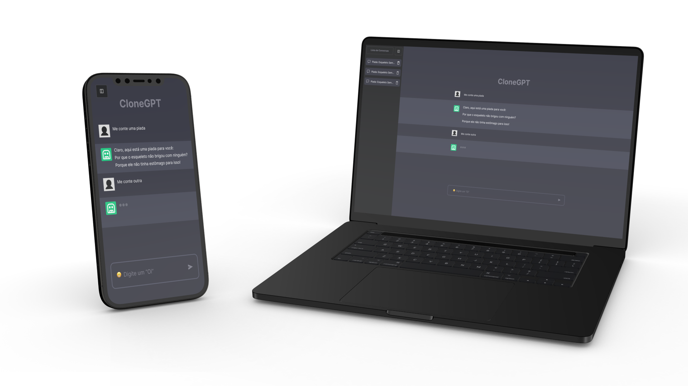

<h1 align="center">
	

  CLONE GPT
</h1>

  <a href="#bookmark-sobre">Sobre</a>&nbsp;&nbsp;&nbsp;|&nbsp;&nbsp;&nbsp;
  <a href="#rocket-tecnologias">Tecnologias</a>&nbsp;&nbsp;&nbsp;|&nbsp;&nbsp;&nbsp;
  <a href="#paintbrush-layout">Layout</a>&nbsp;&nbsp;&nbsp;|&nbsp;&nbsp;&nbsp;
  <a href="https://clone-gpt-openai.vercel.app/" target="_blank">Aplicação na Vercel</a>

  

## :bookmark: Sobre

O **Clone GPT** é uma aplicação desenvolvida em Next JS utilizando a API da OpenAI para gerar textos de maneira natural. O intuito é que o usuário possa conversar com o bot, fazendo perguntas e recebendo respostas.

Para executar a aplicação, realize os passos a seguir:

* Clone o repositório ou realize um fork para o seu GitHub.
* Entre no diretório do projeto --> `cd clone-gpt`.
* Instale as dependências do projeto --> `npm install`.
* Execute a aplicação --> `npm run dev`.

## :rocket: Tecnologias

  - `Next JS`
  > Framework React que utiliza o conceito de SSR (Server Side Rendering) para renderizar as páginas do lado do servidor.
  - `TypeScript`
  > Linguagem de programação que adiciona tipagem estática ao JavaScript.
  - `Tailwind CSS`
  > Framework CSS que utiliza a metodologia CSS-in-JS.
  - `OpenAI`
  > API que utiliza inteligência artificial para gerar textos de maneira natural.
  - `Vercel`
  > Plataforma de hospedagem voltada para aplicações web modernas e escaláveis.

## :paintbrush: Layout

🔗 [Link do design](https://www.figma.com/file/Tm195oJmb0NebY58EAxDFH/Clone-ChatGPT?type=design&node-id=8%3A914&mode=dev)

---
